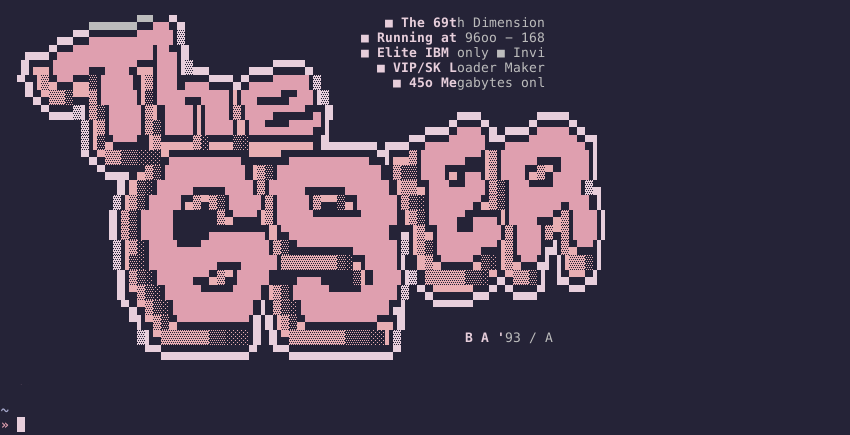

# zsh ansi motd (message of the day)

This zsh plugin adds an old skool ansi art based motd when the login shell is executed



## Why

I grew up in the day's of BBS's and [ ansi art ](https://en.wikipedia.org/wiki/ANSI_art) so I wanted something
to replicate the experience of jumping onto a new BBS everytime I started my login shell

## Installation

```
# for znap
znap source yuhonas/zsh-ansimotd

# for antigen
antigen bundle 'yuhonas/zsh-ansimotd'

# manually
# Clone the repository and source it in your shell's rc file
```

### Getting some awesome ansi art to display
After installation you'll need to download some ansi art for it to randomly display, I suggest
finding a pack you like at [artscene](http://artscene.textfiles.com/artpacks/) and saving it
into the ansi art config directory

```
# using ansi_art_download (a function provided by the plugin) to 
# download all zip files or ansi art from 1996
ansi_art_download http://artscene.textfiles.com/artpacks/1996/

# manually
# Copy one or more zip files containg ansi art into your ansi art config directory 
# which is derived from ${XDG_CONFIG_HOME:-~/.config}/ansimotd
```


